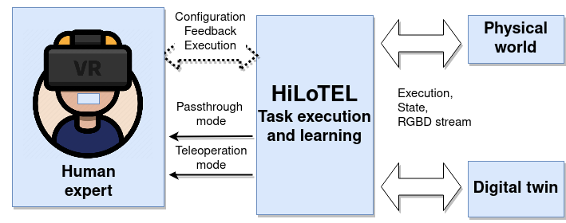
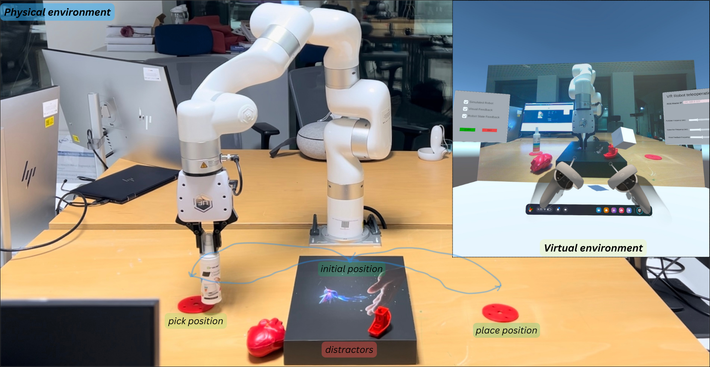

# oculus-robot-teleop

//

This repo is developed to run ----- with Isaac-Orbit to teleoperate robot with oculus quest headset.
- Install the teleop app in oculus
- make sure that your pc running IsaacOrbit and oculus headset are on the same network.
  
**Install oculus-isaac-sim-robot-teleop**
  ```python
  ./install_oculus_teleop.bash
  ```
**Run teleop demo**
```python
  ./run.bash
```

